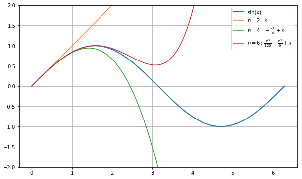

# Instructor Workshop:  Jupyter in the Classroom

### Dan Lewis, Rensselaer Polytechinc Institue, Troy, NY USA

## Workshop Content

This workshop has two parts.  In the first part I will provide an overview of how I use Scientific Ideas, Mathematics, Visual Presentation, Visualization and Computer Language to present applied mathematical concepts to engineering students.  I will use actual course materials to demonstrate the flow of a lecture, stopping along the way to point out the technical features of the Jupyter Notebook environment.

The second part will involve a hands-on activity where the attendees will create a 5 minute mini lecture using "typical" materials that an instructor may have from their current course content.  The session will help demonstrate how to transform existing materials into an interactive classroom activity as shown in the first part of the workshop.

## FAQ

* Why take this session?
	* If you are interested in aligning mathematical concepts, computer programming and interactive visualization with your lecture content, this might be a good medium to explore.
* Who is this session for?
	* Instructors of any topic that can be communicated with quantitative visualization and computer languages.
* What will I learn in this session?
	* You'll see how I communicate to my students and I'll help you get started so you can do this on your own.
* What are Jupyter Notebooks?
	* Come and see!

## Instructor Bio

Dan Lewis is an Associate Professor of Materials Science and Engineering at Rensselaer Polytechnic Institute.  His research program focuses on the science of microstructure development in materials.  His research uses experimental characterization as well as modeling and simulation tools to understand the forces that create and evolve material structures at the micrometer scale.  He is currently working on the development of phase field models for grain growth and solid state phase transformations.  His group currently manages the development of the Mesoscale Microstructure Simulation Project that provides a simple data structure that scales up to multiprocessor systems like Renssleaer’s Blue Gene/Q supercomputer.  He received his Ph.D. from Lehigh University and was awarded a National Research Council Postdoctoral Fellowship at the National Institute of Standards and Technology.  He is currently an Erskine Fellow at the University of Canterbury until October 2017.